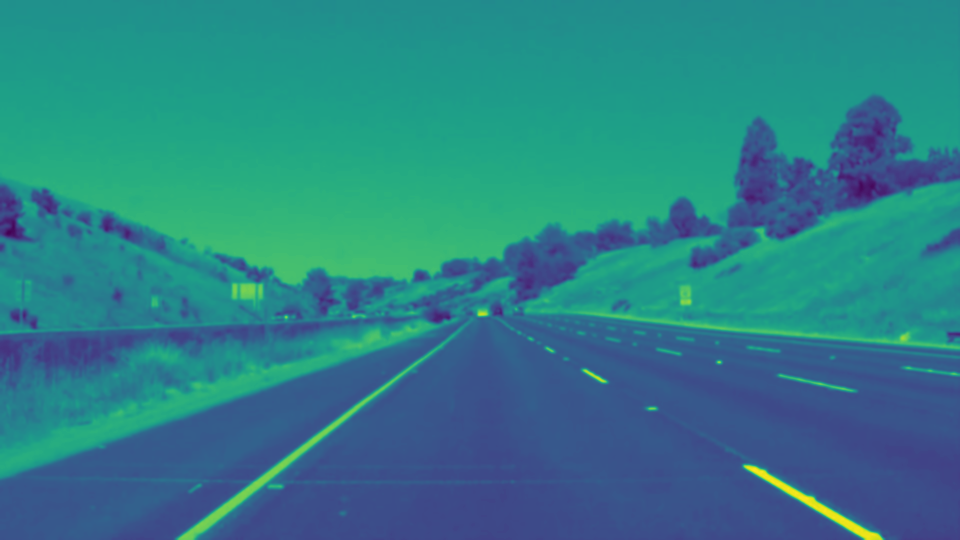
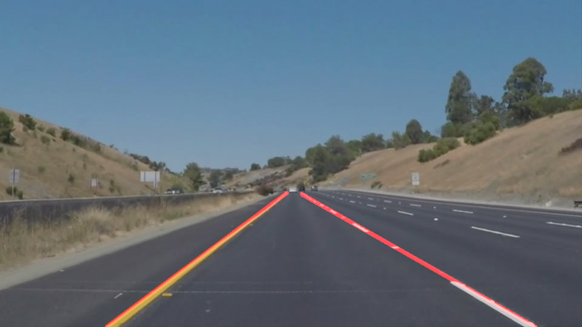

# **Finding Lane Lines on the Road** 
### This project is part of the Computer Vision Course given at the Udacity Self-Driving Nanodegree

---

**Finding Lane Lines on the Road**

---

### Overview

Defined a class that contains the functions and the procedures to pipeline the image and draw the lanes through. Pipeline is classified because it is needed to initialize and process the image groupings in such an order to produce drawings of the lines.

---

The Piplines sequence is handling every image given and is described as the following:

1. The image is being read and the shape of it is taken into the consideration.

2. The image is then grayscaled using the CV2 color conversion and blurred.

3. A high and low threshold of the Canny are set.

4. The region of interest is framed of where the lanes are in the direction of the driveway and the rest is masked out.

5. The hough lines are then processed and weighted.

### Shortcomings

There are some shortcomings at the Challenge, where more horizontal lines are observed at the change of color on the way. I suspect that the problem is with canny edges, that they should be tuned at the low and high thresholds. It could be with the hough lines as well.

### Possible improvements to your pipeline

Taking a window of readings to draw and predict the upper and the bottom lines of the lane, is not the best method. It could not always detect some disturbances that can happen.

### Results

The images' output can be seen at location: /CarND-LaneLines-P1/test_images_output
The videos' output can be seen at location: /CarND-LaneLines-P1/test_videos_output
